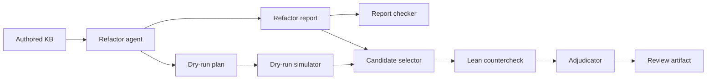
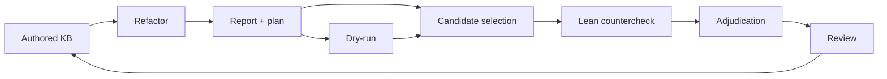

# Improving mdblueprint for Lean-backed Knowledge Graphs

An integrated review workflow for proposing graph refactors and checking them against Lean-derived evidence.

<div class="mt-12 text-sm opacity-70">
Based on the EconCSLib run in <code>refactor-countercheck-run-20260615T143626Z/</code>.
</div>

---

# mdblueprint in One Slide

`mdblueprint` is a Markdown-first knowledge graph system for mathematical libraries.

- `docs/knowledge/nodes/`: admitted mathematical nodes
- `docs/knowledge/staged/`: draft nodes under review
- `uses`: authored logical dependencies
- `topics`: browsing and ownership structure
- `lean`: links to modules and declarations
- deterministic tools: check, lint, stats, render, refactor simulation, Lean countercheck

The graph is an authored mathematical contract, not a generated projection of Lean.

---

# Markdown Is the Source of Truth

The durable object is the authored node.

```yaml
id: game_theory.strategic_game.zero_sum.von_neumann_minimax
title: Von Neumann Minimax Theorem
uses:
  - game_theory.strategic_game.zero_sum.core.value
proved_via_plan: math.minimax.minimax_from_loomis
lean:
  modules:
    - EconCSLib.GameTheory.StrategicGame.ZeroSum.MatrixGame
  declarations:
    - MatrixGame.minimax_theorem
```

Lean links are evidence for review.

They do not overwrite the authored graph by default.

---

# Thesis

`mdblueprint` should make mathematical graph maintenance reviewable, not automatic.

The new workflow demonstrates this on a full EconCSLib run:

- a refactor agent proposes semantic graph-review targets
- deterministic tools validate the report and simulate concrete operations
- Lean countercheck extracts formalization-side evidence for selected nodes
- an adjudicator decides which signals are real discrepancies, false abends, or review cases

The main result is a repeatable path from graph concern to final review artifact.

---

# Why This Is Hard

Lean formalization changes the shape of mathematical content.

- one prose node can correspond to many declarations
- one declaration can expose helper lemmas not worth promoting to nodes
- a proof route can mention objects that are not theorem-statement prerequisites
- topic ownership and Lean module hierarchy can legitimately diverge
- staged variants can look like duplicates while changing hypotheses

So the goal is not "make the Markdown graph match Lean mechanically."

The goal is to focus human review on the right semantic questions.

---

# Presentation Plan

The integrated command contains two conceptually distinct operations.

1. **Generate proposals**

   Use node prose, graph structure, lint findings, staged-node context, and bounded evidence packs to decide what deserves graph-review attention.

2. **Verify and adjudicate proposals**

   Use deterministic report checks, dry-run simulation, Lean counterchecks, and adjudication to decide what the evidence supports.

Integration removes manual handoff.

It does not collapse proposal generation and verification into the same judgment.

---

# Design Philosophy

The repo keeps three responsibilities separate.

| Layer | Owns | Does not own |
| --- | --- | --- |
| agents | proposals, triage, explanations | admitted truth |
| Python tools | validation, simulation, extraction | mathematical judgment |
| human/admission review | accepted graph changes | hidden state |

The integrated workflow keeps every stage inspectable as files in the repo or run directory.

---

# End-to-End Workflow



The pipeline removes manual handoff between proposal generation and Lean-based review.

```bash
uv run mdblueprint-refactor-countercheck --include-staged
```

---

# Run Artifacts

The deck uses this full run:

```text
refactor-countercheck-run-20260615T143626Z/
```

Key files:

<div class="grid grid-cols-2 gap-8 text-sm leading-6">
<div>

**Refactor proposal and dry-run**

`reports/refactor-report.md`<br>
`dry-runs/refactor-plan.yml`, `refactor-dry-run.json`

</div>
<div>

**Lean-based review**

`countercheck/{candidates,pairs,skipped,summary}.json`<br>
`adjudication/adjudication-report.md`

</div>
</div>

---

layout: section
---

# Stage 1

Refactor proposal generation.

---

# Refactor-Agent Contract

The refactor agent reviews node content, graph structure, and deterministic baseline signals.

<div class="grid grid-cols-2 gap-8 text-sm leading-6">
<div>

**Inputs**

node prose and metadata; `uses` and topic structure; graph statistics and high-degree hot spots; duplicate, prose-dependency, staged-overlap, and topic-cycle lint signals; bounded target-node or target-topic evidence packs

</div>
<div>

**Proposal kinds**

dependency cleanup; duplicate or overlap review; missing dependency review; topic ownership changes; split, merge, or generalization requests; proof-plan route separation; formulation-sensitive impact review

</div>
</div>

It must not silently rewrite admitted or staged knowledge files.

---

# Refactor-Agent Guardrails

The useful guidance is not just "find graph problems."

The skill asks the agent to:

- treat included staged nodes as graph-visible, without proposing promotion
- use the generality gate before creating, merging, splitting, or rehoming content
- distinguish proof-route dependencies from theorem-statement dependencies
- inspect formulation-sensitive descendant impact
- run a refinement pass that prioritizes semantic targets over easy lint cleanup

These guardrails are why the run produced reviewable decisions rather than bulk lint repair.

---

# Generality Gate

Before proposing a new node, split, merge, or dependency retargeting, the agent asks:

- what is the most general useful form of the result?
- does that form already exist as an admitted or staged node?
- is the narrower node a deliberate specialization?
- would a bridge or proof-route node be better than a duplicate theorem node?
- is the uncertainty mathematical policy rather than graph hygiene?

This is the anti-bloat rule for mathematical KB refactoring.

---

# Formulation-Sensitive Impact

Graph reachability only says which descendants might be affected.

It does not say how the change percolates.

A descendant may:

- remain valid under other ancestor formulations
- need a proof-route repair
- need a weaker statement
- split into formulation-specific variants
- fail because an equivalence or bridge was removed

The agent therefore reviews exact ancestor formulations before proposing high-impact changes.

---

# Full-KB Baseline

The run used admitted plus staged mode.

| signal | value |
| --- | ---: |
| loaded nodes | 535 |
| admitted nodes | 273 |
| staged nodes | 262 |
| graph edges | 840 |
| lint findings | 405 |
| structural check | 0 errors, 0 warnings |

Largest reverse-dependency hot spots included Nash equilibrium, strategic game, and zero-sum value nodes.

---

# Refactor Report Outcome

The agent produced four semantic proposals.

| proposal | target | classification |
| --- | --- | --- |
| `refactor-001` | strong-complementarity duplicate | semantic review |
| `refactor-002` | minimax proof routes | semantic review |
| `refactor-003` | game-theory topic cycles | human review |
| `refactor-004` | staged/admitted extensive-game overlap | admission or node review |

No proposal was classified as mechanically safe.

---

# Case Study: Strong Complementarity

The agent found two nodes pointing at the same Lean theorem:

- `game_theory.strategic_game.zero_sum.core.strong_complementarity`
- `math.minimax.strong_complementarity`
- Lean declaration: `MatrixGame.exists_strong_complementary_pair`

The agent did not propose automatic deletion.

The mathematical issue is real, but choosing the survivor requires preserving:

- zero-sum topic ownership
- LP proof-route detail
- source interpretation

---

# Case Study: Minimax Proof Routes

The agent treated `von_neumann_minimax` as a high-impact theorem, not as a place to dump every proof-route reference.

Key judgment:

- descendants rely on the minimax theorem statement
- route dependencies belong on proof-plan nodes where possible
- adding every prose reference to theorem `uses` can bloat the ancestor set
- one route candidate can introduce a dependency cycle

This is the kind of judgment a mechanical linter cannot make by itself.

---

# Case Study: Staged Variants

The staged/admitted extensive-game overlaps were not safe duplicate merges.

The staged nodes changed hypotheses:

- chance versus no chance
- imperfect information versus perfect information
- full value theorem versus one-sided Lean evidence

The refactor agent therefore routed them to admission or node review.

That preserves the boundary between graph refactoring and admission.

---

# Refactor Report Takeaways

The report is useful because it explains why not to act mechanically.

- four proposals were semantic review items, not automatic edits
- high-value semantic targets outranked redundant-edge cleanup
- staged variants were kept in admission review rather than promoted or retired
- proof-route references were not copied into theorem-level `uses`
- the dry-run plan was intentionally empty:

```yaml
operations: []
```

The result is disciplined restraint, backed by concrete evidence.

---

layout: section
---

# Stage 2

Lean countercheck and adjudication.

---

# Why Countercheck?

The refactor report is a semantic proposal.

Countercheck asks a different question:

> What does the Lean-linked source text suggest about the same nodes?

It can surface:

- declarations linked to the same authored node
- helper lemmas and sibling theorems near a target
- missing or extra `lean.declarations`
- authored `uses` edges not seen in extracted Lean dependencies
- Lean dependencies that do not map cleanly to authored nodes

This is a factual pressure test, not a verdict.

---

# Two Candidate Sources

The pipeline feeds countercheck from two sources.

| source | why include it |
| --- | --- |
| refactor report | captures semantic candidates even when no edit is safe |
| dry-run output | captures concrete nodes changed by executable operations |

This matters because the two stages answer different questions.

The report may say "this node deserves semantic review."

The dry run may say "this node would actually change."

Both are useful countercheck targets.

---

# Counterchecker Output

For each selected node/Lean-file pair, the counterchecker writes:

- a JSON snapshot of the authored node and extracted Lean declarations
- extracted declaration-to-declaration edges from the Lean file
- matched, missing, and extra declarations
- missing and extra `uses` signals
- a markdown review file for human inspection

The orchestrator also writes:

- `countercheck/candidates.json`
- `countercheck/pairs.json`
- `countercheck/skipped.json`
- `countercheck/summary.json`

The output is deliberately verbose so the adjudicator can reject false alarms with evidence.

---

# What Happened in This Run

The dry-run plan was empty, so all countercheck candidates came from the report.

That is a noteworthy point:

- the refactor agent found semantically meaningful review targets
- none of them had a safe automatic operation yet
- the candidate selector still had enough signal to run Lean-based review
- two candidates were skipped transparently because they lacked Lean metadata

The run produced `13` countercheck pairs from `158,894` extracted Lean names. The raw signals were intentionally routed to adjudication, not treated as direct edit instructions.

---

# Why Raw Signals Need Adjudication

The heuristic extractor sees Lean source text, not mathematical intent.

Common false-abend sources in this run:

- local names versus namespaced authored declarations
- file-level helper leakage
- sibling theorem leakage
- proof-plan granularity
- conceptual authored dependencies not visible as lexical Lean edges

The adjudicator exists because useful Lean evidence is not the same as graph truth.

---

# Adjudication Layer

The adjudicator classifies mismatches case by case.

Possible outcomes:

- true discrepancy
- false abend
- needs review

It should accept coarse authored nodes and proof-plan mappings when they are genuine conceptual anchors.

It should penalize obvious errors such as unrelated mappings, namespace noise, helper-lemma leakage, and proof artifacts promoted to graph truth.

---

# Final Adjudication

The adjudicator's executive decision:

- keep the dry-run empty
- accept the strong-complementarity duplication as a real issue
- reject most raw Lean mismatch alarms as false abends
- keep ordered-field minimax and extensive-game variants in needs-review

| label | meaning in this run |
| --- | --- |
| `true_discrepancy` | duplicate strong-complementarity representation |
| `false_abend` | namespace, helper, sibling, or proof-route noise |
| `needs_review` | genuine ambiguity or insufficient Lean metadata |

---

# Case Study: Minimax False Abends

The counterchecker found missing uses and extra helper declarations around the minimax route.

Affected nodes included:

- `game_theory.strategic_game.zero_sum.von_neumann_minimax`
- `math.minimax.loomis_theorem`
- `math.minimax.minimax_from_loomis`

The adjudicator rejected these as automatic edit grounds.

The Lean facts reflect proof-plan granularity and file-local helpers; theorem-level `uses` should not absorb every proof artifact.

---

# Case Study: Staged Value With Chance

The staged node `zero_sum_perfect_information_value_with_chance` remained a needs-review case.

Lean exposed:

- `ZeroSumChance.GameTree.value`
- `ZeroSumChance.GameTree.DStrategy`
- `ZeroSumChance.GameTree.value_prop`

The adjudicator treated this as insufficient for automatic acceptance.

The staged node appears to claim a fuller value theorem than the one-sided Lean fact extracted from `value_prop`.

---

# What Lean Confirmed

Lean evidence strengthened the refactor report in two ways.

First, it confirmed the duplicate:

- both strong-complementarity nodes map to the same theorem
- the issue is many-to-one authored-node mapping, not merely similar prose

Second, it supported restraint around minimax:

- route nodes and helper lemmas explain the proof
- theorem-level `uses` should not absorb every formal proof artifact

This is a useful validation of the refactor agent's semantic judgment.

---

# What Lean Did Not Settle

Some questions remained outside deterministic resolution.

- whether `math.minimax.ordered_field_minimax` should keep its conceptual edge to real minimax
- whether staged with-chance value claims are too strong for current Lean evidence
- how topic cycles should treat catalog or index nodes
- which strong-complementarity node should be canonical

The pipeline did not pretend these were automatic decisions.

It produced review targets with evidence.

---

layout: section
---

# Integration

One tool suite, two review directions.

---

# How the Two Stages Fit



Proposal generation asks: what should we review or change?

Counterchecking asks: what does Lean-derived evidence say about those choices?

---

# Complementary Strengths

| Workflow | Strong at | Weak at |
| --- | --- | --- |
| refactor agent | semantic triage, generality, formulation impact, bounded proposal writing | proving correctness, detecting all Lean-local dependencies |
| dry-run simulator | exact structural consequences of proposed operations | mathematical truth |
| Lean countercheck | surfacing formalization drift and declaration granularity | deciding authored graph ownership |
| adjudicator | classifying mismatches for review | replacing human mathematical policy |

The combined workflow makes each limitation explicit.

---

# Review Policy

Different signals should route to different owners.

- redundant edge with preserved reachability: dry-run and structural check
- duplicate theorem representation: semantic node review
- staged overlap: admission-referee workflow
- proof-route dependency question: proof-plan or body-aware review
- Lean module/topic mismatch: taxonomy or Lean-alignment review
- declaration cluster hidden in one node: adjudicated countercheck proposal

This keeps refactoring, admission, and Lean alignment from collapsing into one task.

---

# What This Adds to mdblueprint

The repo gains a more complete improvement loop.

Before:

- validate and publish authored nodes
- run refactor and Lean review as separate workflows

After:

- generate bounded graph-refactor proposals
- structurally simulate concrete graph edits
- preserve staged-node optionality
- select countercheck candidates from both report targets and dry-run changes
- countercheck proposals against Lean-derived signals
- adjudicate true discrepancies, false abends, and review cases

The workflow stays review-first throughout.

---

# Holistic Outcome

The useful result is not any single tool, but the way the stages sharpen one another.

- the refactor stage found semantic graph-review targets
- the dry-run stage showed no automatic edit was currently safe
- the Lean countercheck stage tested those targets against formalization evidence
- the adjudication layer separated one true discrepancy from false abends and needs-review cases

In this EconCSLib run:

- loaded graph: `535` nodes and `840` edges
- proposals: `4` semantic review items
- dry-run plan: `operations: []`
- countercheck: `13` node/file pairs and `2` skipped candidates
- adjudication: strong-complementarity duplicate accepted; most raw mismatches rejected as false abends

The value add is a justified review bundle, not an automatic patch.

---

# What Improved

The combined workflow improved four things at once.

- proposal quality: graph statistics, lint signals, staged context, and bounded packs made the agent's suggestions concrete
- structural safety: dry-run simulation prevented semantic uncertainty from becoming graph churn
- formal review quality: countercheck surfaced declaration granularity and helper-lemma noise explicitly
- judgment quality: adjudication distinguished the real duplicate from false abends and review-only cases

The headline outcome is simple:

- `mdblueprint` now has a repeatable path from graph concern -> dry-run -> Lean countercheck -> final judgment
- the pipeline remains review-first
- the pipeline shows why a change should or should not be accepted

---

# Remaining Gaps

The integrated run also exposed what still needs attention.

- qualified-name matching still creates false abends
- helper lemmas and sibling declarations still leak into extracted evidence
- staged variants still need admission review, not refactor automation
- topic-cycle policy is not settled by Lean evidence

---

# Final Takeaway

The end-to-end workflow now has a useful shape:

1. the refactor stage proposes semantic graph-review targets
2. the dry-run stage confirms whether any concrete operation is safe
3. the Lean countercheck stage tests selected nodes against formalization evidence
4. the adjudicator decides whether mismatch is real, false, or unresolved

For this run, the strongest result was disciplined restraint:

one real duplicate, many false abends, several review cases, and no unsafe automatic edits.

That is the value add: the pipeline can separate a real graph issue from formalization noise without rewriting the authored KB.

---

# What Comes Next

- tune qualified-name and helper-leakage handling if needed
- send staged extensive-game variants to admission review
- run focused node review for strong complementarity and ordered-field minimax
- decide topic-cycle policy for catalog and index nodes
- use future retests to compare proposal quality, not just functional completion

---

layout: section
---

# Annex

Where to inspect the run.

---

# Annex Files

Top-level annex folder:

```text
refactor-countercheck-run-20260615T143626Z/
```

Recommended review order:

1. `SUMMARY.md`
2. `reports/refactor-report.md`
3. `dry-runs/refactor-plan.yml`
4. `dry-runs/refactor-dry-run.json`
5. `countercheck/candidates.json`
6. `countercheck/pairs.json`
7. `countercheck/skipped.json`
8. `countercheck/summary.json`
9. `adjudication/adjudication-report.md`

The event logs are retained in the annex for reproducibility, not for presentation.
